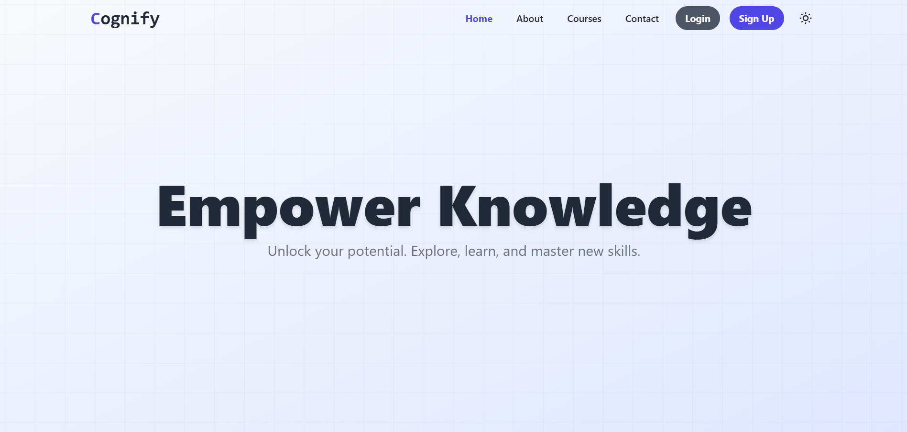
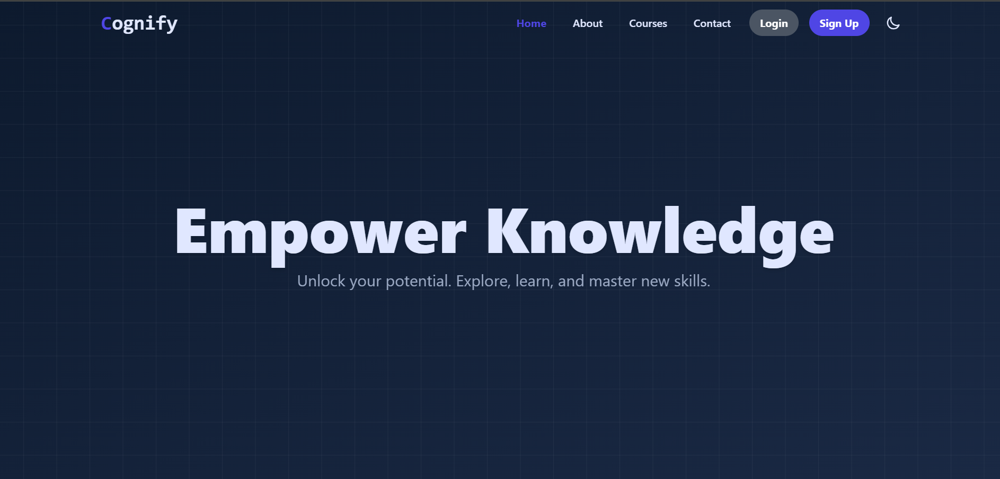
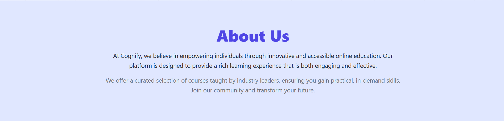
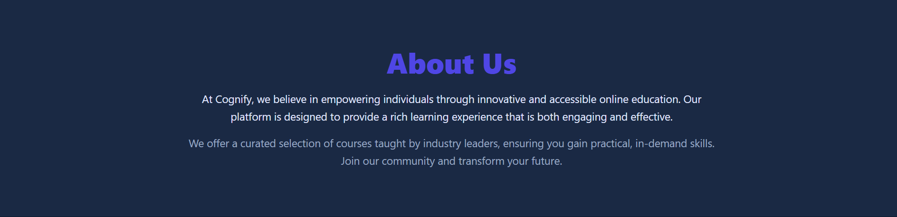
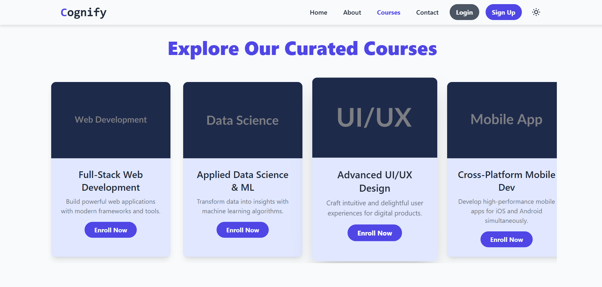
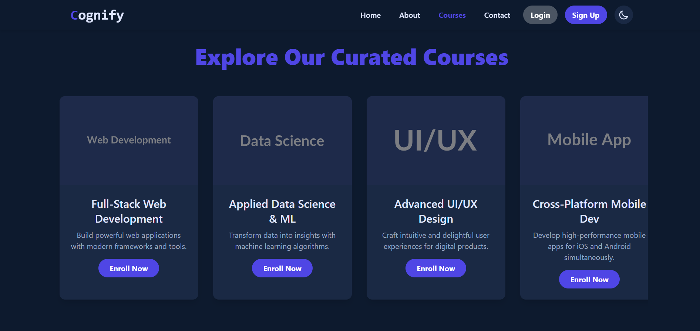
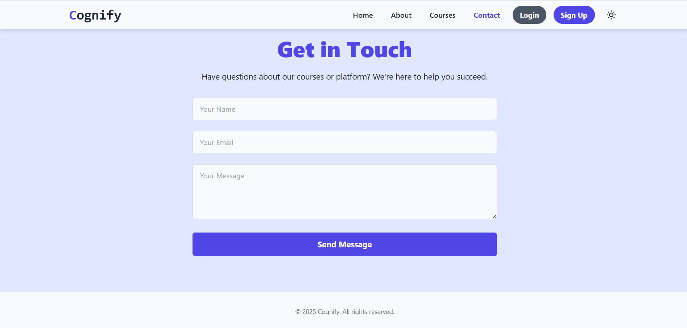
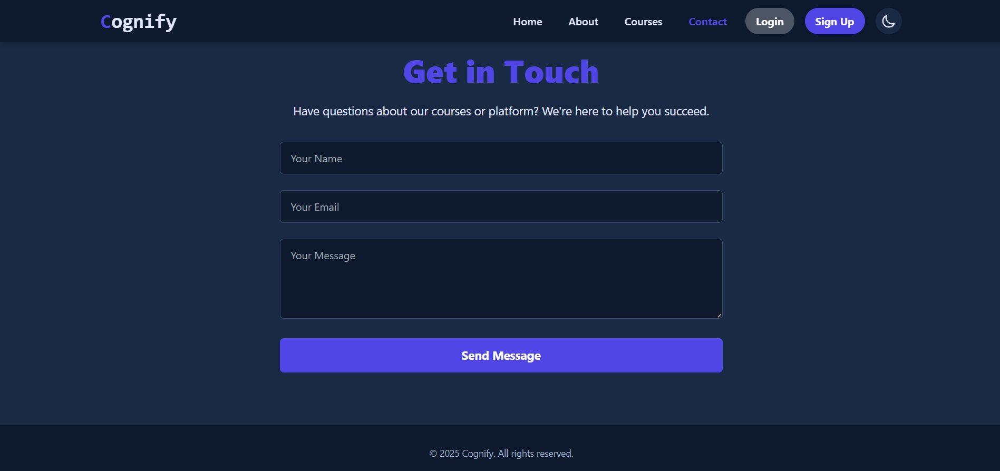

# Elearning_Platform
A modern and responsive **E-Learning Website** developed using **HTML, CSS, and JavaScript**.  
The platform provides an engaging learning interface with smooth navigation, a theme changer, and a visually appealing geometrical background.  

This project is **frontend-only** and designed as a demonstration of clean web design and interactive UI components.  

---

## Features

- **Responsive Design** built with pure HTML, CSS, and JavaScript  
- **Smooth Navigation** across sections (Home, About, Courses, Contact)  
- **Authentication Buttons**: Login and Sign Up  
- **Theme Changer**: Toggle between light and dark modes  
- **Geometrical Background** with a modern look  
- **Frontend Only**: No backend or database is included  

---

## Project Structure
'''
Elearning_platform
│── src/
│ ├── index.html # Main entry point
│ ├── main.css # Styles (layout, colors, responsiveness)
│ ├── main.js # Interactivity (theme changer, navigation effects)
│
│── LICENSE # Project license
│── README.md # Documentation
'''

---

## Screenshots

### Homepage  
The homepage features a modern layout with a responsive navigation bar, theme toggle, and smooth scrolling between sections.  
- **Light Theme**  
    
- **Dark Theme**  
    

### About Section  
The about section introduces the platform’s purpose and highlights the benefits of learning online with a clean and minimal design.  
- **Light Theme**  
    
- **Dark Theme**  
    

### Courses Section  
The courses section presents a structured catalog of available courses with descriptions and clear enrollment options.  
- **Light Theme**  
    
- **Dark Theme**  
    

### Contact Section  
The contact section provides a simple and professional interface for users to reach out, including a form and essential details.  
- **Light Theme**  
    
- **Dark Theme**  
    

---

## Technologies Used

- **HTML5** – Semantic structure of the web pages  
- **CSS3** – Styling, responsive layout, and modern UI design  
- **JavaScript (ES6)** – Theme switching and interactive elements  
